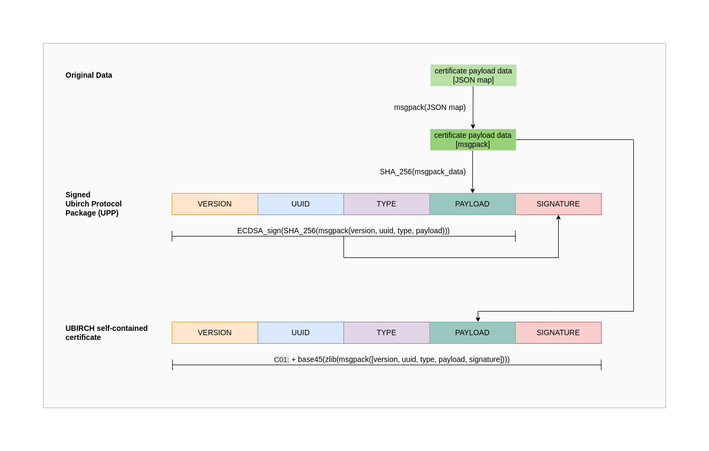
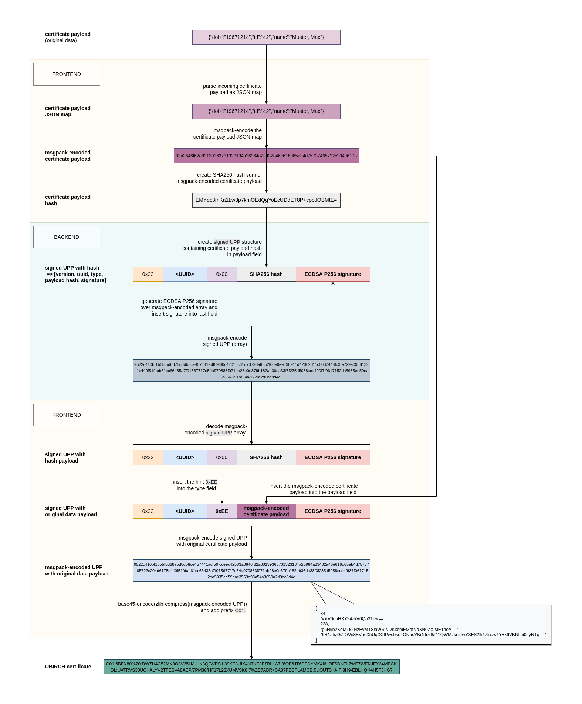
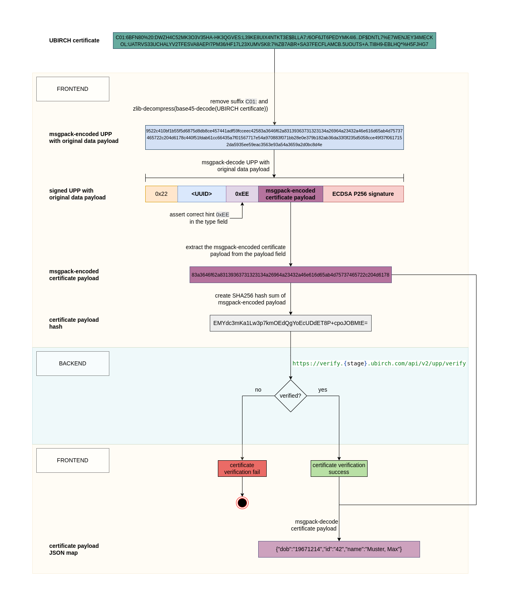

# UBIRCH Certificate Reference

A reference implementation for creating and verifying UBIRCH self-contained certificates in python.

## Specification



## Setup

Requires Python3.9 or higher.

```commandline
python3 -m venv venv3
. venv3/bin/activate
pip install -r requirements.txt
```

## UBIRCH Certificate Creation

1. [Install dependencies](#setup)
2. Set the required [environment variables](#environment-variables-for-certificate-creation)
3. Run the [`create_certificate.py` script](src/create_certificate.py) passing the certificate payload data (JSON)
   as command line argument, see [example](#certificate-creation-example-call)

### Environment Variables for Certificate Creation

| Variable                    | Description                                                                            |
|-----------------------------|----------------------------------------------------------------------------------------|
| UBIRCH_CLIENT_CERT_PFX_FILE | client certificate file [*.pfx] [^1]                                                   |
| UBIRCH_CLIENT_CERT_PWD_FILE | file containing the client certificate password [^1]                                   |
| UBIRCH_IDENTITY_UUID        | UUID of the target identity [^1]                                                       |
| UBIRCH_ENV                  | _optional_: the UBIRCH backend environment ("dev" / "demo" / "prod"), default = "prod" |
| LOGLEVEL                    | _optional_: logging level ("DEBUG" / "INFO" / "WARNING" / "ERROR"), default = "INFO"   |

### Certificate Creation Example Call

> Certificate payload data has to be unique. Before running the example call, the input file has to be modified in order
> to create a unique hash. Otherwise, the script will exit with an error "This data has already been anchored before".

```commandline
UBIRCH_ENV=<stage> \
UBIRCH_CLIENT_CERT_PFX_FILE=<client certificate filename>.pfx \
UBIRCH_CLIENT_CERT_PWD_FILE=<client certificate password filename>.txt \
UBIRCH_IDENTITY_UUID=<target identity ID> \
python3 src/create_certificate.py <certificate payload filename>.json [<certificate-prefix>]
```

The resulting certificate will look like this:

```text
C01:6BFN80%20:DWZH4C52MK3O3V35HA-HK3QGVES:L39KE8UIX4NTKT3E$BLLA7:/6OF6JT6PEDYMK4I6..DF$DNTL7%E7WENJEY34MECK OL:UATRVS33UCHALYV2TFESVA8AEP/7PM36/HF17L23XUMVSK8:7%ZB7ABR+SA37FECFLAMCB.5UOUTS+A.TI8H9-EBLHQ*%H5FJHG7
```

### QR code generation

```commandline
python3 src/create_qr_code.py '<base45-encoded certificate>' [<qr-code-filename>.png]
```

### Certificate Creation Process



## UBIRCH Certificate Verification

1. [Install dependencies](#setup)
2. Set the [environment variables](#environment-variables-for-certificate-verification)
3. Run the [`verify_certificate.py` script](src/verify_certificate.py) passing the certificate
   as command line argument, see [example](#certificate-verification-example-call)

### Environment Variables for Certificate Verification

| Variable                    | Description                                                                            |
|-----------------------------|----------------------------------------------------------------------------------------|
| UBIRCH_VERIFICATION_TOKEN   | access token for the UBIRCH verification service [^1]                                  |
| UBIRCH_ENV                  | _optional_: the UBIRCH backend environment ("dev" / "demo" / "prod"), default = "prod" |
| LOGLEVEL                    | _optional_: logging level ("DEBUG" / "INFO" / "WARNING" / "ERROR"), default = "INFO"   |

### Certificate Verification Example Call

```commandline
UBIRCH_ENV=<stage> \
python3 src/verify_certificate.py 'C01:6BFN80%20:DWZH4C52MK3O3V35HA-HK3QGVES:L39KE8UIX4NTKT3E$BLLA7:/6OF6JT6PEDYMK4I6..DF$DNTL7%E7WENJEY34MECK OL:UATRVS33UCHALYV2TFESVA8AEP/7PM36/HF17L23XUMVSK8:7%ZB7ABR+SA37FECFLAMCB.5UOUTS+A.TI8H9-EBLHQ*%H5FJHG7'
```

> Due to processing time in the UBIRCH backend, it is possible for the verification of a certificate to fail shortly
> after its creation.

### Certificate Verification Process



[^1]: Contact support@ubirch.com to get a client certificate, identity UUID and access token.